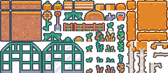

## Texture

Tekstura je fensi ime za sliku koja se nalazi u vram-u na grafickoj.
Png i jpg fajlovi se cuvaju na disku i oni su kompresovani, kada se program pokrene
slike se citaju iz ovih fajlova i prebacuju na graficku, teksture nisu kompresovane i
cuvaju se kao dvodimenzioni niz piksela. 

### Sampler
Teksturama mozemo da pristupamo (da citamo rgb vrednosti piksela) samo iz `shader`a.
Prvo ucitamo teksturu, zatim prosledimo teksturu kao `uniform`u `shader`u, i na kraju procitamo rgb vrednost pomocu `texture()` funkcije.
Ceo kod izgleda ovako:
```glsl
//fragment shader
in vec2 texCoord;
uniform sampler2D slika;

void main(){
    vec4 color=texture(slika,texCoord);
}
```
`sampler2D` je ime tipa podatka za teksturu, `texture` funkcija prima teksturu i koji piksel se cita.
Bitno je napomenuti da koordinate u teksturi uvek idu od 0 do 1 po x i y osama. Koordinate su realni brojevi.
Nije bitno da li je slika rezolucije 8\*8, 1920\*1080... uvek su koordinate od 0 do 1 u oba smera.

### Filter
U openGL slika pored piksela cuva i neka podesavanja za nacin na koji se citaju boje iz teksture. Jedno podesavanje je 
filter. Ako sliku rezolucije 100\*100 crtam u kvadratu velicine 100\*100 sve je super, ne treba mi filter. Problem nastaje 
kada sliku velicine 16\*16(na primer pixel art sprite) crtam na kvadrat velicine 100\*100, ili obrnuto kada sliku velike rezolucije slikam u mali pravougaonik.
Postoje 3 filtera, linear, nearest i mipmap. Linear zamuti sliku kada se crta u pravougaonik razlicite velicine, ovo je dobro za 
3d igrice, realisticne teksture kao sto su kamen i drvo. Nearest pikselizuje sliku kada se crta u pravougaonik razlicite velicine,
ovo se uglavnom koristi za pixel art igrice. Mipmap je modernija varijanta linear filtera, kada se tekstura ucita opengl 
od nase slike generise slike manje razolucije, i u zavisnosti od toga koliko je igrac daleko od trougla, koristi sliku koja odgovara
rezoluciji za tu udaljenost, ovo se isto uglavnom koristi za 3d igrice.
### Repeat
Ako u javi pristupimo elementu sa indeksom manjim od 0 ili vecim od duzine niza program ce da se kresuje.
Tekstura je niz piksela, ali graficka je napravljena tako da se ne kresuje kada pristupimo pikselu van slike.
Mozemo da podesimo sta se desava u tom slucaju. Postoje opcije repeat, repeat-mirrored, clamp-to-edge i clamp-to-border.
Repeat samo ponavlja sliku, ako pristupim pikselu sa koodinatom (0.1 , 1.5) ili (0.1 , 3.5) to je isto kao da pristupim (0.1 , 0.5),
samo uzme decimalu od x i y koordinate. Repeat-mirrored je isto kao repeat samo sto svaki drugi put flipuje teksturu.
Clamp-to-border vraca uvek istu boju ako pristupimo pikselu sa koordinatom vecom od 1 ili manjom od 0.
Clamp-to-edge ogranicava x i y koordinatu na 0 i 1, znaci ako posaljem koordinatu izmedju 0 i 1 samo mi procita piksel,
a ako stavim veci od 4.6 pretvori koordinatu u 1.

### Texture Unit
Nekoliko hiljada instanci fragment shadera se izvrsavaju paralelno i svaka instanca moze da procita bilo koji piksel iz slike, na bilo kojoj poziciji.
Ovakvo citanje zahteva poseban cip koji je napravljen samo za paralelno citanje iz teksture. Ovaj cip se zove texture unit.
Moderne graficke imaju skoro uvek 32 texture unit-a. Texture unit moze da cita samo jednu teksturu od jednom.
Znaci da u jednom shader-u mozemo da koristimo maksimalno 32 slike od jednom. Zbog ovog ogranicenja cesto se 
vise slika spaja u jednu veliku sliku, jedan primer je sprite sheet.<br><br>
